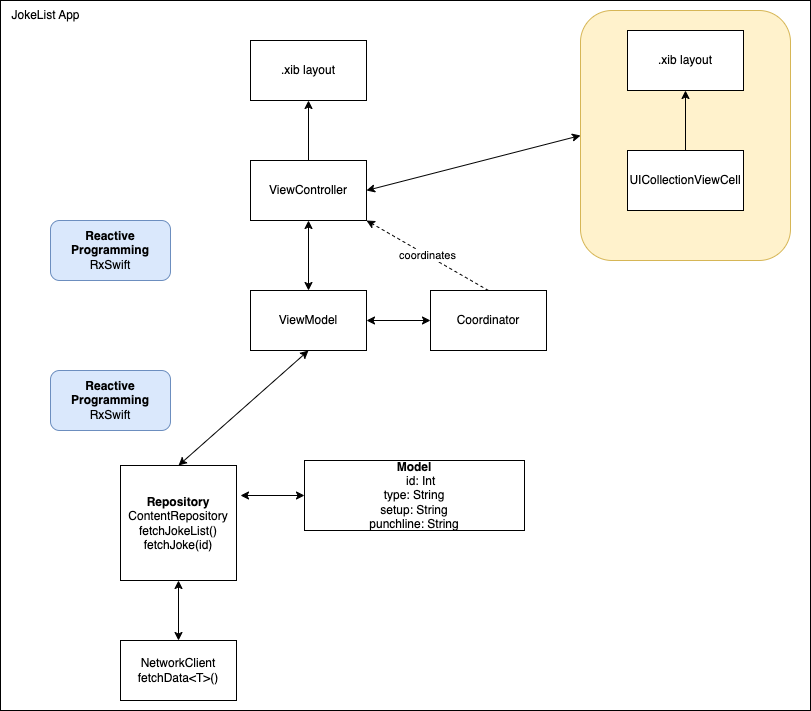

# iOS-JokesListAPI-RxSwift-MVVMC

Create a simple Jokes List App using RxSwift framework and MVVM-C architecture and with Unit Testing.

Target:
1. Show data in list
2. Show how to fetch data
3. Pass data to next page
4. Show how to do Unit Tests

Flow:
1. Load app and fetch jokeslist API
2. Update UI with jokeslist API response to the list
3. If select a joke in the list, will open new detail page
the data `id` of the selected joke will be passed to detail page
4. in detail page, the `id` will be processed to fetch jokedetail API
5. Update UI with jokedetail API response to the detail page

# API

https://official-joke-api.appspot.com/jokes/ten

https://official-joke-api.appspot.com/jokes/{{id}}

# Tech Stack
- UIKit
- RxSwift
- Alamofire
- Swinject
- Unit Test (Quick, Nimble)

# Diagram

